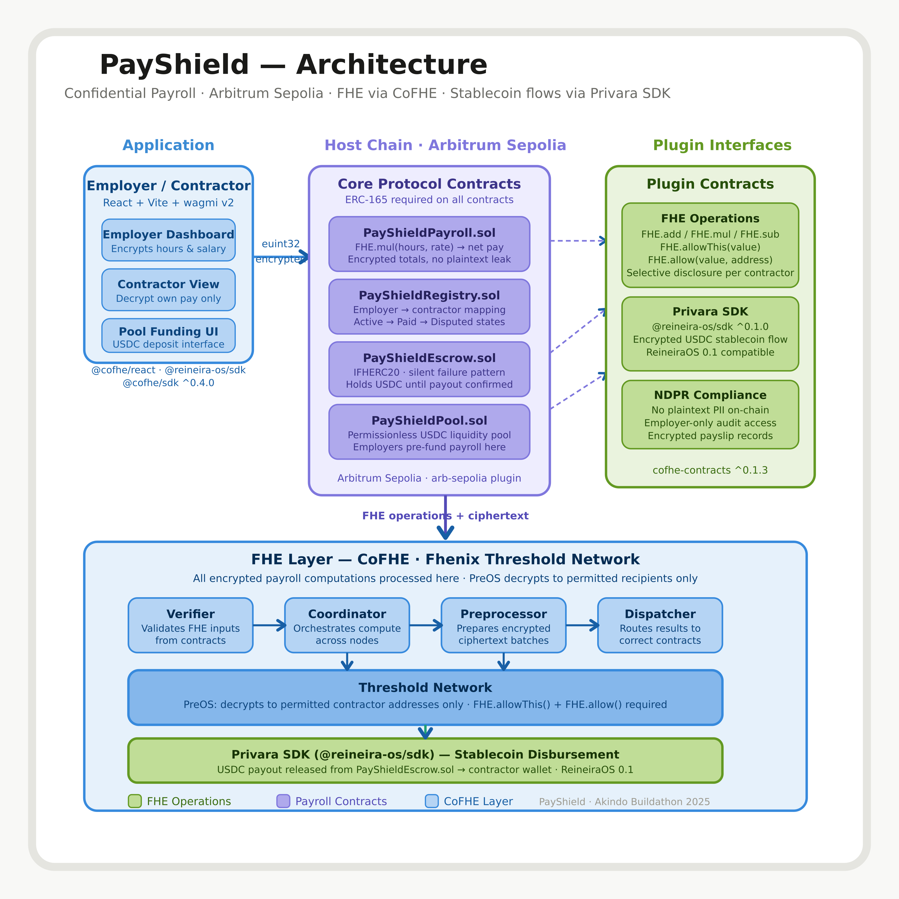

# 🛡️ PayShield

Confidential payroll processing for contractors, built with CoFHE on Arbitrum Sepolia.

## ❗ Problem Statement

Traditional on-chain payroll leaks sensitive compensation metadata. Even if funds are transferred securely, raw salary numbers can still appear in mempools, events, or contract state.

PayShield is designed so payroll arithmetic happens on encrypted values end-to-end:

- 🔐 Contractor hours are encrypted client-side.
- 🔐 Contractor rates are encrypted client-side.
- 🧮 Payroll computation executes on ciphertext with `FHE.mul(hours, rate)`.
- 👤 Only authorized recipients can decrypt outputs.

Why FHE is required: encryption in transit alone is insufficient because values become plaintext during smart-contract execution in typical designs. With CoFHE, values stay encrypted during computation, preserving confidentiality for both employers and contractors.

## 🏗️ Architecture (3 Layers)



### 📚 Layer Responsibilities

1. App Layer
    - Encrypts payroll inputs in browser.
    - Submits encrypted payloads to contracts.
2. Host Chain (Arbitrum Sepolia)
    - Coordinates payroll lifecycle and access control.
    - Stores encrypted records and payout state.
3. CoFHE Layer
    - Executes homomorphic operations such as `FHE.mul`.
    - Supports controlled decryption for entitled addresses.

## 📁 Monorepo Structure

```text
payshield/
├── README.md
├── .gitignore
├── backend/
│   ├── contracts/
│   │   ├── PayShieldPayroll.sol
│   │   ├── PayShieldRegistry.sol
│   │   ├── PayShieldEscrow.sol
│   │   └── PayShieldPool.sol
│   ├── test/
│   │   ├── PayShieldPayroll.test.ts
│   │   ├── PayShieldRegistry.test.ts
│   │   └── PayShieldEscrow.test.ts
│   ├── scripts/
│   │   └── deploy.ts
│   ├── tasks/
│   │   ├── fund-payroll.ts
│   │   └── process-payout.ts
│   ├── deployments/
│   │   └── .gitkeep
│   ├── .env.example
│   ├── hardhat.config.ts
│   ├── package.json
│   ├── reineira.json
│   └── tsconfig.json
└── frontend/
     ├── public/
     │   └── favicon.ico
     ├── src/
     │   ├── components/
     │   │   ├── EmployerDashboard.tsx
     │   │   ├── PayrollForm.tsx
     │   │   ├── ContractorView.tsx
     │   │   └── PoolFunding.tsx
     │   ├── hooks/
     │   │   ├── usePayroll.ts
     │   │   └── useFHE.ts
     │   ├── lib/
     │   │   └── config.ts
     │   ├── App.tsx
     │   └── main.tsx
     ├── .gitignore
     ├── eslint.config.js
     ├── index.html
     ├── package.json
     ├── tsconfig.app.json
     ├── tsconfig.node.json
     └── vite.config.ts
```

## ⚙️ Tech Stack

| Package | Version | Location |
|---|---|---|
| hardhat | ~2.26.x | backend |
| @fhenixprotocol/cofhe-contracts | ^0.1.3 | backend |
| @cofhe/hardhat-plugin | ^0.4.0 | backend |
| @cofhe/sdk | ^0.4.0 | backend + frontend |
| @reineira-os/sdk | ^0.1.0 | backend + frontend |
| ethers | ^6.x | backend |
| typechain | ^8.x | backend |
| typescript | ^5.x | backend + frontend |
| react | ^18.x | frontend |
| vite | ^5.x | frontend |
| wagmi | ^2.x | frontend |
| viem | ^2.x | frontend |
| @cofhe/react | ^0.4.0 | frontend |
| node | >=20 | runtime |

## 🚀 Setup

```bash
cd backend
npm install
cp .env.example .env

cd ../frontend
npm install
```

## ✅ Wave 2 Validation

Executed in `backend/`:

```bash
HARDHAT_DISABLE_VSCODE_INSTALL_PROMPT=true npx hardhat test
HARDHAT_DISABLE_VSCODE_INSTALL_PROMPT=true npx hardhat typechain
```

Test output:

```text
PayShieldEscrow
    ✔ uses silent failure when payroll is not confirmed
    ✔ releases payout after employer confirms payroll

PayShieldPayroll
    ✔ computes encrypted net pay with FHE.mul and keeps values encrypted
    ✔ marks payroll as employer-confirmed

PayShieldRegistry
    ✔ registers contractor and stores employer contractor list
    ✔ enforces Active -> Paid -> Disputed transitions

6 passing
```

Judge-signal assertion is included in `backend/test/PayShieldPayroll.test.ts` via:

- `hre.cofhe.mocks.expectPlaintext(netPayHandle, 1000n)`

This confirms ciphertext payroll multiplication correctness without exposing plaintext on-chain.

## 🌊 Wave 3 Status

Completed:

- Frontend encrypted payroll flow in `EmployerDashboard.tsx` + `PayrollForm.tsx`
- Contractor decrypt flow in `ContractorView.tsx`
- Pool funding flow in `PoolFunding.tsx`
- `useFHE.ts` encrypt/decrypt helper hook using CoFHE client and permits
- `usePayroll.ts` wagmi contract interaction hook
- Frontend production build passes (`npm run build`)

Pending external runtime inputs for full testnet demo:

- Set frontend env vars (`VITE_PAYSHIELD_*` addresses, RPC URL)
- Set backend `.env` value `USDC_ADDRESS` (deployment currently fails fast if missing)
- Deploy contracts on Arbitrum Sepolia and save addresses to `backend/deployments/`

## 📚 Resources
 
- [Fhenix CoFHE Docs](https://cofhe-docs.fhenix.zone/)
- [CoFHE Hardhat Starter](https://github.com/fhenixprotocol/cofhe-hardhat-starter)
- [Privara / ReineiraOS Docs](https://reineira.xyz/docs)
- [Privara SDK on npm](https://www.npmjs.com/package/@reineira-os/sdk)
- [Awesome Fhenix Examples](https://github.com/FhenixProtocol/awesome-fhenix)
- [Arbitrum Sepolia Faucet](https://faucet.quicknode.com/arbitrum/sepolia)
 
---
 
## 📄 License
 
MIT © 2025 PayShield Contributors
 
---
 
> *PayShield is built for the gig worker who deserves privacy, the employer who needs compliance, and the protocol that makes both possible — without compromise.*
 