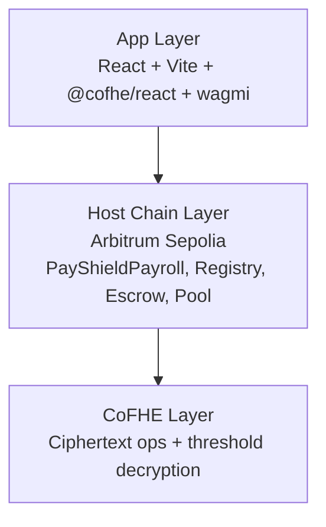

# 🛡️ PayShield

Confidential payroll processing for contractors, built with CoFHE on Arbitrum Sepolia.

## ❗ Problem Statement

Traditional on-chain payroll leaks sensitive compensation metadata. Even if funds are transferred securely, raw salary numbers can still appear in mempools, events, or contract state.

PayShield is designed so payroll arithmetic happens on encrypted values end-to-end:

- 🔐 Contractor hours are encrypted client-side.
- 🔐 Contractor rates are encrypted client-side.
- 🧮 Payroll computation executes on ciphertext with `FHE.mul(hours, rate)`.
- 👤 Only authorized recipients can decrypt outputs.

Why FHE is required: encryption in transit alone is insufficient because values become plaintext during smart-contract execution in typical designs. With CoFHE, values stay encrypted during computation, preserving confidentiality for both employers and contractors.

## 🏗️ Architecture (3 Layers)



### 📚 Layer Responsibilities

1. App Layer
    - Encrypts payroll inputs in browser.
    - Submits encrypted payloads to contracts.
2. Host Chain (Arbitrum Sepolia)
    - Coordinates payroll lifecycle and access control.
    - Stores encrypted records and payout state.
3. CoFHE Layer
    - Executes homomorphic operations such as `FHE.mul`.
    - Supports controlled decryption for entitled addresses.

## 📁 Monorepo Structure

```text
payshield/
├── README.md
├── .gitignore
├── backend/
│   ├── contracts/
│   │   ├── PayShieldPayroll.sol
│   │   ├── PayShieldRegistry.sol
│   │   ├── PayShieldEscrow.sol
│   │   └── PayShieldPool.sol
│   ├── test/
│   │   ├── PayShieldPayroll.test.ts
│   │   ├── PayShieldRegistry.test.ts
│   │   └── PayShieldEscrow.test.ts
│   ├── scripts/
│   │   └── deploy.ts
│   ├── tasks/
│   │   ├── fund-payroll.ts
│   │   └── process-payout.ts
│   ├── deployments/
│   │   └── .gitkeep
│   ├── .env.example
│   ├── hardhat.config.ts
│   ├── package.json
│   ├── reineira.json
│   └── tsconfig.json
└── frontend/
     ├── public/
     │   └── favicon.ico
     ├── src/
     │   ├── components/
     │   │   ├── EmployerDashboard.tsx
     │   │   ├── PayrollForm.tsx
     │   │   ├── ContractorView.tsx
     │   │   └── PoolFunding.tsx
     │   ├── hooks/
     │   │   ├── usePayroll.ts
     │   │   └── useFHE.ts
     │   ├── lib/
     │   │   └── config.ts
     │   ├── App.tsx
     │   └── main.tsx
     ├── .gitignore
     ├── eslint.config.js
     ├── index.html
     ├── package.json
     ├── tsconfig.app.json
     ├── tsconfig.node.json
     └── vite.config.ts
```

## ⚙️ Tech Stack

| Package | Version | Location |
|---|---|---|
| hardhat | ~2.26.x | backend |
| @fhenixprotocol/cofhe-contracts | ^0.1.3 | backend |
| @cofhe/hardhat-plugin | ^0.4.0 | backend |
| @cofhe/sdk | ^0.4.0 | backend + frontend |
| @reineira-os/sdk | ^0.1.0 | backend + frontend |
| ethers | ^6.x | backend |
| typechain | ^8.x | backend |
| typescript | ^5.x | backend + frontend |
| react | ^18.x | frontend |
| vite | ^5.x | frontend |
| wagmi | ^2.x | frontend |
| viem | ^2.x | frontend |
| @cofhe/react | ^0.4.0 | frontend |
| node | >=20 | runtime |

## 🚀 Setup

```bash
cd backend
npm install
cp .env.example .env

cd ../frontend
npm install
```

## 🧾 Commit Message Convention

Pattern:

```text
<type>(<scope>): <short description>
```

Types: `feat | fix | test | docs | chore | refactor | deploy`

Examples:

- `feat(contracts): add PayShieldPayroll.sol with FHE.mul payroll computation`
- `feat(frontend): add EmployerDashboard with @cofhe/react input encryption`
- `deploy(arb-sepolia): deploy all contracts and persist addresses`